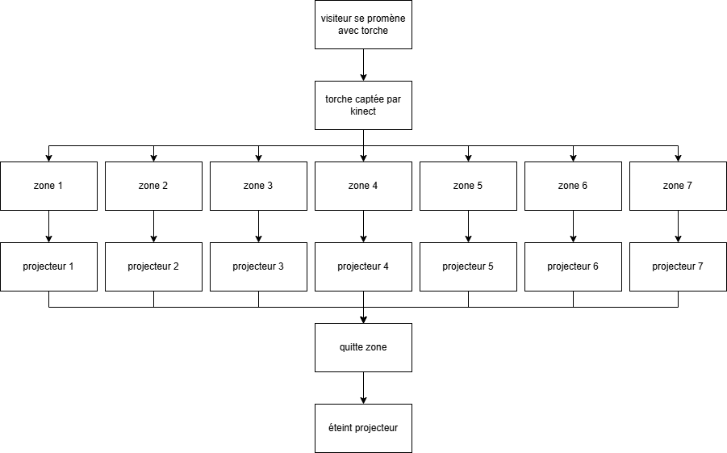
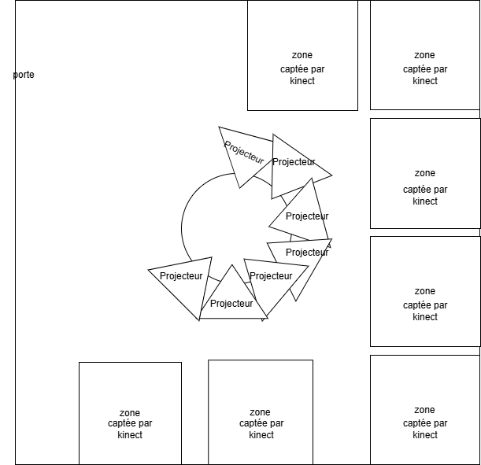

# Planification
## Concept
Dans "L'art du feu", nous visitons une grotte qui a été marqué par l'homme à l'époque de la préhistoire, grâce à une fausse torche.

## Plan des interractions 

## Liste des équipements
- Projecteurs
[texte](http://a.com)

- Fausse torche
[Amazon](https://www.amazon.fr/Plastique-Accessoires-Comp%C3%A9titions-Sportives-Soir%C3%A9es/dp/B0D7TSFM8Y?th=1)

- M5 Stack Light Unit
[texte](http://a.com)

- Haut-parleurs
[texte](http://a.com)

## Plantation

## Circulation des visiteurs
Les visiteurs peuvent aller où ils veulent dans la pièce étant donné que chaque zone d'activation est indépendante. Il n'y a rien au sol donc pas beaucoup de risque. Le plus gros risque c'est que quelqu'un casse la colonne centrale de la grotte donc il faut la faire solide.
## Logiciel
- Arduino
- TouchDesigner

