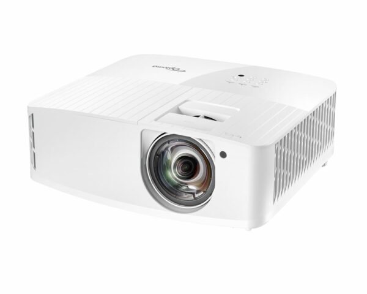
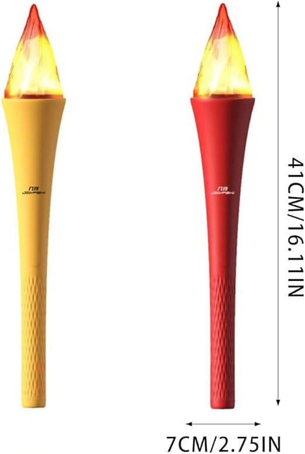

# Planification
## Concept
Dans "L'art du feu", nous visitons une grotte qui a été marqué par l'homme à l'époque de la préhistoire, grâce à une fausse torche.

## Plan des interractions 

## Liste des équipements
- Projecteurs
[Référence](https://www.bureauengros.com/products/3094403-fr-optoma-technology-4k400stx-projecteur-dlp-4k-uhd-a-courte-focale-4-000-lumens)

- Fausse torche
[Amazon](https://www.amazon.fr/Plastique-Accessoires-Comp%C3%A9titions-Sportives-Soir%C3%A9es/dp/B0D7TSFM8Y?th=1)

- M5 Stack Light Unit
[Référence](https://shop.m5stack.com/products/light-sensor-unit?srsltid=AfmBOorNsn8w6lPf4RSCPVQR6sDdNjOL1NkxvfuT9M15n-dvJ8Dk4AJT)
- Haut-parleurs
[Référence](https://statics.teams.cdn.office.net/evergreen-assets/safelinks/1/atp-safelinks.html)

## Plantation

## Circulation des visiteurs et sécurité
Les visiteurs peuvent aller où ils veulent dans la pièce étant donné que chaque zone d'activation est indépendante. Il n'y a rien au sol donc pas beaucoup de risque. Le plus gros risque c'est que quelqu'un casse la colonne centrale de la grotte donc il faut la faire solide et le plus possible camoufler les éléments qui ne vont pas avec le décor (Projecteurs, haut-parleurs)
## Logiciels
- Arduino
- TouchDesigner
